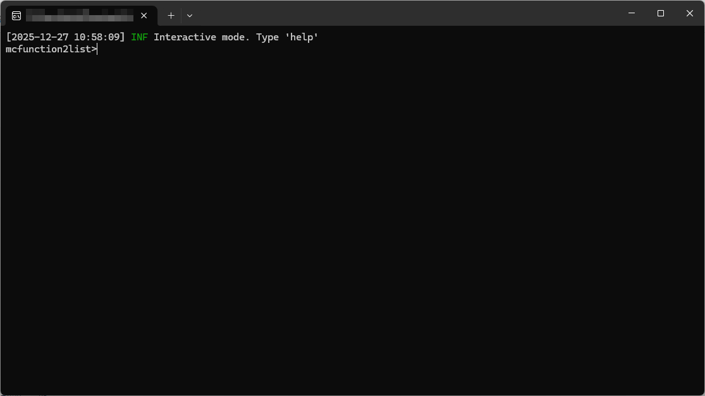

# mcfunction2list
mcfunctionからlas(点群データ)をMinecraft Bedrockに移植する場合に必要なものです



※専用ツールとなっております。

# 使用方法
## ビルドバイナリを使う方法

1. まず最新のリリースから.exeやBinaryをダウンロードします。
2. ダウンロードしたBinaryを実行します。
3. コマンドプロンプト又はターミナルが出てきたら、```generate [入力 (.mcfunction 又はそれが入っているフォルダー)] [出力 (出力先フォルダー)]```を入力して変換します。
   ※```mcfunction2list>```とコンソールで出ている場合に行ってください。
4. 変換が終わったらまた```mcfunction2list>```となるので、作業は終了です。


## ソースコードからビルドする方法

1. ソースを.zip又は、```git clone https://github.com/androidprod/mcfunction2list.git```とコマンドを実行し、ソースコードダウンロードします。
2. cmakeをインストールされていることを確認し、```.\build.bat```又はLinuxではchmodで許可してから```./build.sh```を実行しビルドします。
3. ```./build/Release```又は、```./build/```のなかにBinaryがあれば成功です。
   ※ここからは上記の実行方法と同じです。
4. 生成されたBinaryを実行します。
5. コマンドプロンプト又はターミナルが出てきたら、```generate [入力 (.mcfunction 又はそれが入っているフォルダー)] [出力 (出力先フォルダー)]```を入力して生成します。
   ※```mcfunction2list>```とコンソールで出ている場合に行ってください。
6. 生成が終わったらまた```mcfunction2list>```となるので、作業は終了です。


# 作成者 
androidprod
